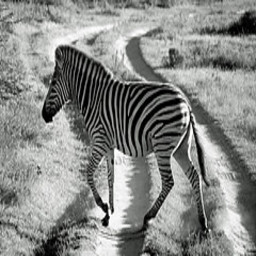
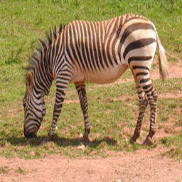

# 基于pytorch的cycleGANk复现

[cycleGAN官方代码](https://github.com/junyanz/pytorch-CycleGAN-and-pix2pix)

# 介绍

本复现项目中，使用resnet_9blocks作为生成器模型，使用3层的NLayerDiscriminator作为判别器模型。

训练相关参数与流程，均包含在cycle_gan.py文件中，总体不超200行，简单易懂，可读性极强。

调用代码为transfer.py，只需载入模型并指定图片，即可完成调用。

# 效果

| 原图                                                             | 官方                                                             | 复现                                                           |
|----------------------------------------------------------------|----------------------------------------------------------------|--------------------------------------------------------------|
|   |   |   |
|   |   |   |
|   |   |   |
|   |   |   |
|   |   |   |
|   |   |   |

# 训练

```shell
conda create -n cycleGAN python=3.8
conda activate cycleGAN
pip install -r requirements.txt

# 修改cycle_gan.py中213行，图片目录
python cycle_gan.py
```

你也可以下载本项目训练好的[生成器模型](https://github.com/yatengLG/cycleGAN/releases/tag/1.0.0)
# 损失

| G_loss                             | D_loss                            | GAN_loss                               | cycle_loss                                 | idt_loss                              |
|------------------------------------|-----------------------------------|----------------------------------------|--------------------------------------------|---------------------------------------|
|   |  |   |   |  |


# 过程

|              | EPOCH 0                                                           | EPOCH 30                                                               | EPOCH 40                                                              | EPOCH 50                                                              | EPOCH 80                                                              | EPOCH 120                                                               | EPOCH 160                                                               | EPOCH 200                                                               |
|--------------|-------------------------------------------------------------------|------------------------------------------------------------------------|-----------------------------------------------------------------------|-----------------------------------------------------------------------|-----------------------------------------------------------------------|-------------------------------------------------------------------------|-------------------------------------------------------------------------|-------------------------------------------------------------------------|
| horse2zebra  |  |   |  |  |  |  |  |  | 
| zebra2horse  |      |   |  |  |  |  |  |  | 

# 效果不好的案例

| 原图                                                          | 官方                                                          | 复现                                                        |
|-------------------------------------------------------------|-------------------------------------------------------------|-----------------------------------------------------------|
|    |    |    |
|  |  |  |

